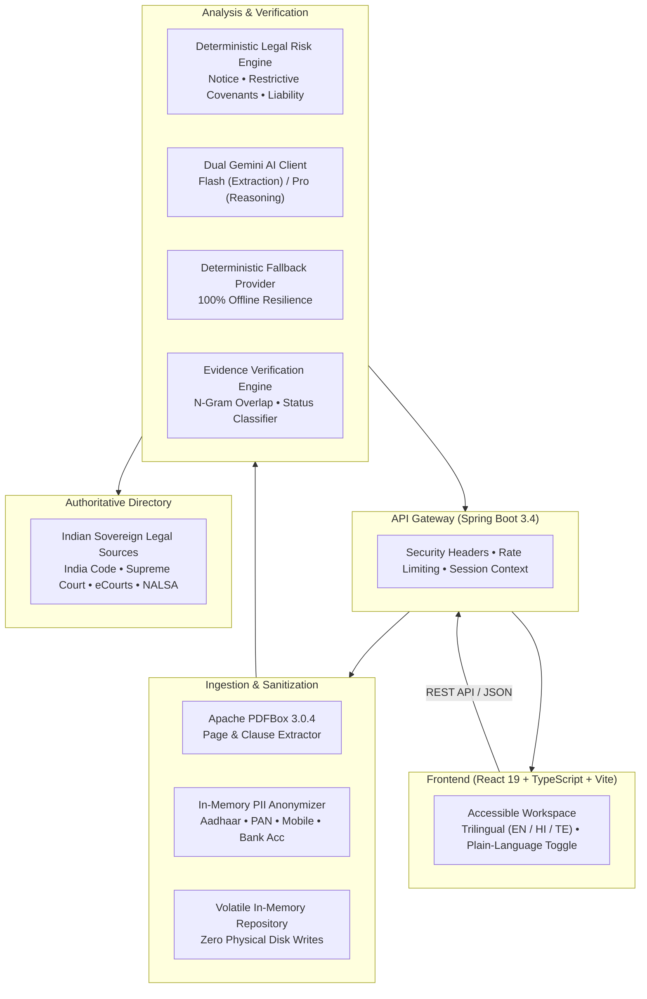

# NyayaLens

An evidence-grounded legal intelligence and contract analysis platform designed for the Indian legal and contractual context. NyayaLens parses complex agreements, flags risks with verbatim clause citations, and protects citizen personal data in accordance with India's Digital Personal Data Protection (DPDP) Act, 2023.

Developed by **Atharva Kanojia**

---

## Overview

Understanding legal contracts—such as residential tenancy leases, employment agreements, and non-disclosure terms—is often challenging for tenants, employees, and small business owners. When people turn to generic generative AI tools for help, they encounter two critical risks: **hallucinations** (fabricated legal citations or invented clauses) and **privacy violations** (leaking personal identifiers like Aadhaar, PAN, and banking details to external cloud models).

NyayaLens addresses these challenges through a zero-trust architecture:

- **Evidence Grounding**: Every finding, risk flag, and answer is deterministically verified against the source text using n-gram overlap scoring.
- **Privacy by Design**: Sensitive Indian identifiers (Aadhaar, PAN, phone numbers, email, bank details) are masked in-memory before any text is processed by AI.
- **Action-Oriented Output**: Beyond summarizing text, the system generates procedural preparation steps, evidence checklists, and precise questions to ask a qualified advocate.
- **High Reliability**: Operates with a dual-model Gemini setup (`gemini-3.8-flash` for extraction and fast Q&A, `gemini-3.1-pro-preview` for multi-document comparisons), backed by a deterministic offline fallback engine that guarantees full functionality even without an API key.

---

## System Architecture



---

## Core Capabilities

### 1. 3-Column Analysis Workspace
- **Clause Navigator**: Structured section-by-section breakdown of the agreement with search filtering and page indicators.
- **Analysis Stream**: Plain-language executive summary, key dates, financial obligations, and categorized contractual risk cards.
- **Evidence Inspector**: Verbatim clause excerpts with a continuous confidence meter and verification badges (`VERIFIED`, `INFERRED`, `NOT_FOUND`, `NEEDS_REVIEW`). Clicking a risk automatically jumps to and highlights the relevant clause.

### 2. Zero-Hallucination Evidence Verification
- Generates n-gram token overlap scores against original clause text to ensure no claims are made without textual evidence.
- Features a dedicated **Transparency Audit** that explicitly reports what the document does *not* contain (e.g., absence of severance terms or missing cure periods), preventing false assumptions.

### 3. Semantic Document Comparison
- Compares base agreements against follow-up documents (such as an employment agreement vs. an immediate separation notice, or an 11-month lease vs. a rent escalation demand).
- Highlights added obligations, stripped rights, and conflicting clauses with categorized impact assessments and practical recommendations.

### 4. Grounded Conversational Q&A
- Allows users to query their contract using natural language.
- Produces direct, factual answers backed by clause citations, exact page references, and verification confidence metrics.

### 5. ActionPath & Consultation Brief
- Synthesizes findings into a step-by-step procedural roadmap: documentation to gather, deadlines to verify, and formal response considerations.
- Generates clause-referenced questions tailored for discussion with qualified legal counsel, exportable and printable in one click.

### 6. DPDP Act 2023 Compliance & Security
- In-memory regex redaction for Indian identifiers prior to AI processing.
- Volatile in-memory session storage with zero physical disk writes and an instant emergency session data wipe option.
- Defense against prompt injection through strict delimiter fencing (`<UNTRUSTED_DOCUMENT_CONTENT>`).

### 7. Accessibility & Regional Language Support
- WCAG 2.1 AA compliant design with high contrast, semantic structure, skip-to-content links, and full keyboard navigation.
- Trilingual user interface supporting English, Hindi (हिन्दी), and Telugu (తెలుగు).
- "Explain Simply" toggle that translates legal jargon into everyday language.

---

## Tech Stack

| Layer | Technology | Version | Purpose |
| :--- | :--- | :--- | :--- |
| **Backend** | Java | 21+ | Core runtime environment |
| | Spring Boot | 3.4.3 | REST API, Security, Actuator |
| | Apache PDFBox | 3.0.4 | PDF text extraction & page segmentation |
| **Frontend** | React | 19.0.0 | User interface & state management |
| | TypeScript | 5.7.3 | Type safety and strict validation |
| | Vite | 6.2.0 | Frontend build tool and dev server |
| | Lucide React | 1.16.0 | Minimal, consistent iconography |
| **AI Layer** | Google Gemini | 3.8 Flash | Low-latency extraction, summaries, Q&A |
| | Google Gemini | 3.1 Pro Preview | Multi-document semantic diff & reasoning |
| | Offline Engine | Internal | Deterministic zero-failure fallback |
| **DevOps** | Docker | Multi-stage | Single lightweight production container (<250MB) |

---

## Getting Started

### Prerequisites
- **Java Development Kit (JDK) 21+** (Eclipse Temurin or Oracle JDK)
- **Apache Maven 3.9+**
- **Node.js 20+** and **npm**
- *(Optional)* **Docker**

---

### Method 1: Local Development (Recommended)

#### 1. Backend Setup
```bash
# Navigate to backend directory
cd backend

# Run automated tests (all 17 test suites)
mvn clean test

# Start the Spring Boot application
mvn spring-boot:run
```
The backend starts at `http://localhost:8080`. Health endpoint: `http://localhost:8080/api/v1/health`.

#### 2. Frontend Setup
In a new terminal window:
```bash
# Navigate to frontend directory
cd frontend

# Install dependencies
npm install

# Build check (validates TypeScript compilation)
npm run build

# Start the development server
npm run dev
```
The Vite development server runs at `http://localhost:5173` and automatically proxies `/api` calls to the Spring Boot backend on port `8080`.

---

### Method 2: Docker Container (Single Container Deployment)

NyayaLens includes a multi-stage `Dockerfile` that builds both the frontend static bundle and the Spring Boot backend into an optimized JRE runtime container:

```bash
# Build the unified image
docker build -t nyayalens:latest .

# Run the container
docker run -p 8080:8080 \
  -e GEMINI_API_KEY="your_api_key_here" \
  nyayalens:latest
```

Open `http://localhost:8080` in your web browser.

---

## Configuration & Environment Variables

Create a `.env` file in the root directory or configure environment variables directly:

| Variable | Default | Description |
| :--- | :--- | :--- |
| `SERVER_PORT` | `8080` | Port for the backend API server |
| `GEMINI_API_KEY` | *(empty)* | Google Gemini API key. If omitted, the deterministic fallback engine activates automatically. |
| `GEMINI_FLASH_MODEL` | `gemini-3.8-flash` | Gemini model for entity extraction, summaries, and Q&A |
| `GEMINI_PRO_MODEL` | `gemini-3.1-pro-preview` | Gemini model for multi-document comparisons |
| `CORS_ALLOWED_ORIGINS` | `http://localhost:5173,...` | Comma-separated list of allowed origins |
| `MAX_UPLOAD_SIZE_MB` | `15` | Maximum document upload file size |
| `MAX_DOCUMENT_PAGES` | `50` | Maximum page count for PDF documents |
| `RATE_LIMIT_ANALYZE_RPM` | `10` | Rate limit for document analysis (requests per min) |
| `RATE_LIMIT_QUESTION_RPM` | `30` | Rate limit for conversational queries |

> **Note on Offline Mode**: If no `GEMINI_API_KEY` is provided, NyayaLens runs in high-fidelity deterministic fallback mode. All features—including the three preloaded demo scenarios—function normally with zero crashes or blank screens.

---

## Preloaded Demonstration Scenarios

NyayaLens includes three realistic synthetic contract scenarios ready to launch with one click from the Dashboard:

1. **Employment Dispute**: Apex Tech Solutions Employment Agreement vs. Immediate Separation Notice. Demonstrates detection of a notice period mismatch (60 days required vs. 7 days offered), void non-compete clauses under Section 27 of the Indian Contract Act, and missing severance pay.
2. **Tenancy Escalation**: 11-Month Residential Lease Agreement vs. Landlord Escalation Notice. Demonstrates detection of an unlawful 25.7% rent increase violating the contractually stipulated 5% renewal ceiling.
3. **NDA Comparison**: Standard Mutual Non-Disclosure Agreement vs. Aggressive Vendor NDA. Demonstrates identification of perpetual confidentiality surviving termination, uncapped unilateral indemnity, and distant foreign jurisdiction clauses.

---

## Documentation

Comprehensive architecture, security, and verification documentation is located in the `docs/` folder:

- [Product Requirements Document (PRD)](file:///d:/Workspace/Web_Workspace/NyayaLens/docs/PRD.md)
- [Technical Architecture & System Design](file:///d:/Workspace/Web_Workspace/NyayaLens/docs/ARCHITECTURE.md)
- [Security, Threat Model & DPDP Compliance](file:///d:/Workspace/Web_Workspace/NyayaLens/docs/SECURITY.md)
- [GenAI Pipeline & Verification Engine](file:///d:/Workspace/Web_Workspace/NyayaLens/docs/AI_PIPELINE.md)
- [REST API Reference](file:///d:/Workspace/Web_Workspace/NyayaLens/docs/API.md)
- [Automated Test Strategy & Test Suite](file:///d:/Workspace/Web_Workspace/NyayaLens/docs/TESTING.md)
- [Deployment Guide (Docker & Cloud Hosting)](file:///d:/Workspace/Web_Workspace/NyayaLens/docs/DEPLOYMENT.md)
- [Evaluator & Demo Walkthrough Guide](file:///d:/Workspace/Web_Workspace/NyayaLens/docs/DEMO.md)
- [Accessibility Audit (WCAG 2.1 AA)](file:///d:/Workspace/Web_Workspace/NyayaLens/docs/ACCESSIBILITY.md)

---

## Author

**Atharva Kanojia**  
Project Creator & Lead Developer

---

## Legal Disclaimer

NyayaLens is an informational and procedural preparation platform, not a law firm, and does not provide formal legal representation or legal advice. All outputs and findings are strictly grounded in user-provided documents and should be reviewed with qualified legal counsel before initiating formal legal proceedings.
