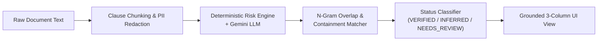

# NyayaLens GenAI Pipeline & Grounding Architecture

## 1. Dual-AI Model Strategy

NyayaLens pairs two cutting-edge Gemini models to balance speed, cost, reasoning depth, and factual grounding:

```
                  ┌────────────────────────────────────────┐
                  │          NyayaLens API Gateway         │
                  └───────────────────┬────────────────────┘
                                      │
                   Task Routing & Complexity Classification
                                      │
            ┌─────────────────────────┴─────────────────────────┐
            ▼                                                   ▼
┌───────────────────────────────┐               ┌───────────────────────────────┐
│       Gemini 3.8 Flash        │               │     Gemini 3.1 Pro Preview    │
│  (High Speed • Low Latency)   │               │   (Deep Reasoning • Synthesis)│
├───────────────────────────────┤               ├───────────────────────────────┤
│ • Page Ingestion & Extraction │               │ • Cross-Document Semantic Diff│
│ • Plain-Language Summary      │               │ • Hidden Contradiction Audit  │
│ • Real-time Conversational Q&A│               │ • Strategic Procedural Roadmap│
│ • Trilingual Translations     │               │ • Lawyer Consultation Briefs  │
└───────────────────────────────┘               └───────────────────────────────┘
```

### Why Gemini 3.8 Flash?
- Sub-second first-token latency ensures real-time conversational responsiveness in "Ask My Document".
- Highly optimized for structured JSON extraction of explicit contractual entities: parties, effective dates, notice periods, and financial amounts.

### Why Gemini 3.1 Pro Preview?
- Superior reasoning capability required to cross-compare multiple conflicting legal documents (e.g. comparing an original 3-year employment contract against a subsequent unilateral termination notice).
- Detects subtle omissions and contractual traps (e.g., perpetual confidentiality surviving contract termination without bilateral reciprocity).

---

## 2. Prompt Engineering & JSON Schema Enforcement

All prompts in `PromptRegistry.java` enforce strict output formatting:
- **Zero Hallucination Mandate**: "If the document is silent on an obligation, explicitly state that it was not found. Never infer or invent statutory penalties not in the text."
- **Structured JSON Schema**: Prompts define exact TypeScript-compatible keys (`claimText`, `clause`, `pageNumber`, `excerpt`, `severity`, `confidence`).
- **Untrusted Content Boundaries**: All user contract text is enclosed in `<UNTRUSTED_DOCUMENT_CONTENT>` tags.

---

## 3. The 4-Stage Grounding & Verification Pipeline



1. **Stage 1 - Sectionizing**: Apache PDFBox chunks documents into clauses with page tags. PII (Aadhaar, PAN, phone, email) is anonymized.
2. **Stage 2 - Parallel Extraction**: Deterministic heuristics extract rule-based red flags (e.g., notice < 30 days) while Gemini extracts nuanced contractual obligations and unusual clauses.
3. **Stage 3 - N-Gram Evidence Scoring**: For each claim, the verifier scans raw clause text for exact sub-phrase overlap and assigns a continuous confidence score from `0.0` to `1.0`.
4. **Stage 4 - Status Classification**:
   - `confidence >= 0.8` with direct quote: `VERIFIED`
   - Claim derived from contextual silence: `INFERRED`
   - Discrepancy between parties or vague phrasing: `NEEDS_REVIEW`
   - Absent from contract: `NOT_FOUND`

---

## 4. Deterministic Offline Fallback Guarantee

Hackathon evaluations often take place in high-stress, low-connectivity, or key-restricted environments. NyayaLens includes a dedicated `DeterministicFallbackProvider` covering all 3 curated demo scenarios. When no `GEMINI_API_KEY` is configured or if a network partition occurs, the system automatically serves high-fidelity deterministic analyses. The UI remains 100% interactive and fully functional.
